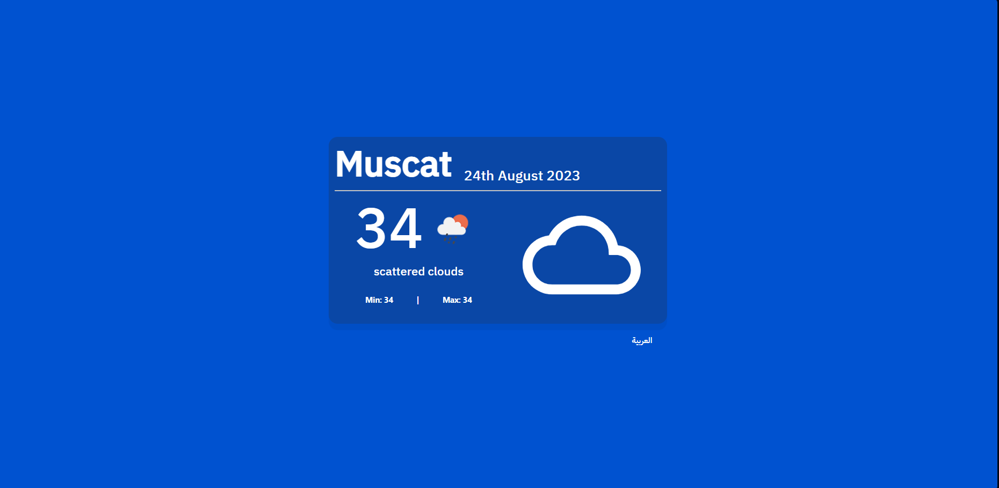
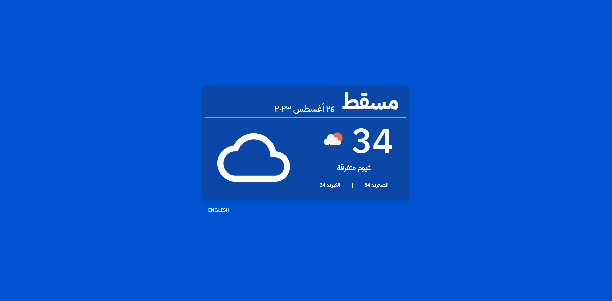

# Api weather by ReactJS

-I built a weather website using the openweathermap API. First, I understood the API through the Postman program, then I built the interface of the site and linked it from the API, after that I added the English language so that the site supports two languages, and finally I added some creative touches.

URL : (https://64e79ffcb82a96087cde8808--shiny-kleicha-fd7a76.netlify.app)

## I used the following tools and libraries: 
1. Material UI
2. Google fonts
3. icons8
4. axios  - api -
5. momentjs - time & date - 
6. i18next - translation-

## ------

